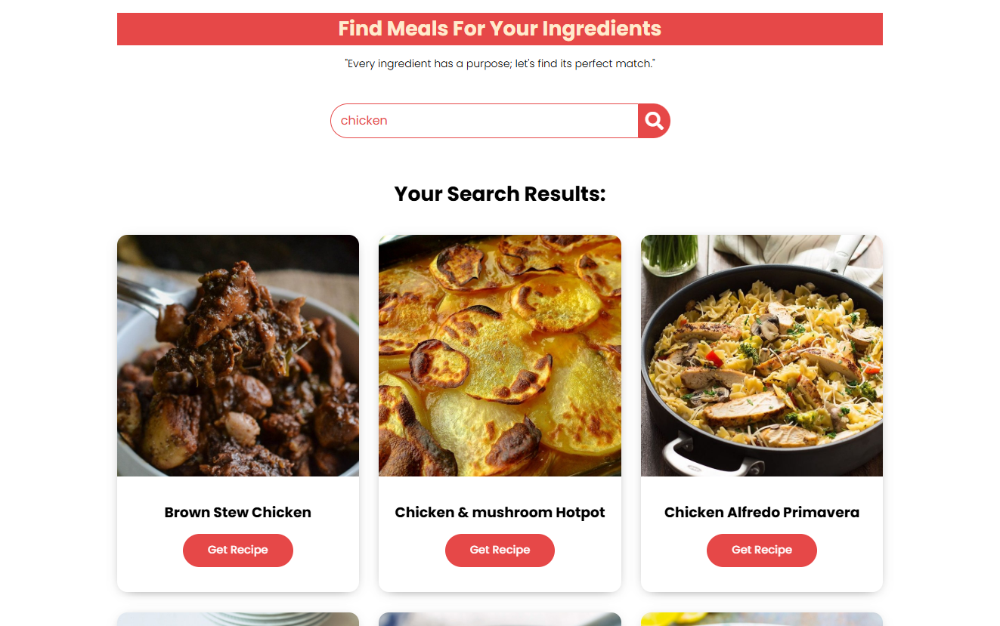
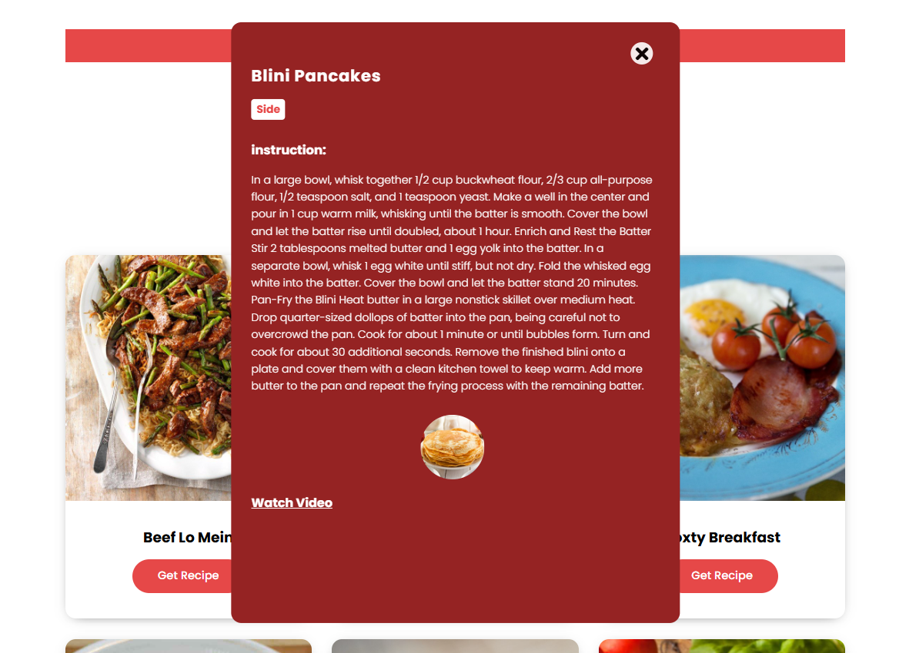

# Find Meals For Your Ingredients
"Find Meals For Your Ingredients" is a web application built using HTML, CSS, and JavaScript. It is designed to help users discover recipes based on the ingredients they have on hand. Simply enter the ingredients you have, and the app will suggest various recipes, making meal planning quick and easy.

##Features
* **Ingredient Search:** Find recipes based on ingredients you have.
* **Recipe Details:** View detailed instructions, ingredients, and nutritional info.
* **Video Links:** Watch video tutorials for easy cooking.
* **Beautiful UI:** A clean and user-friendly design for a seamless experience.
---

## Technologies Used
- HTML
- CSS3
- JavaScript
- Fetch API

## Screenshots

--------

